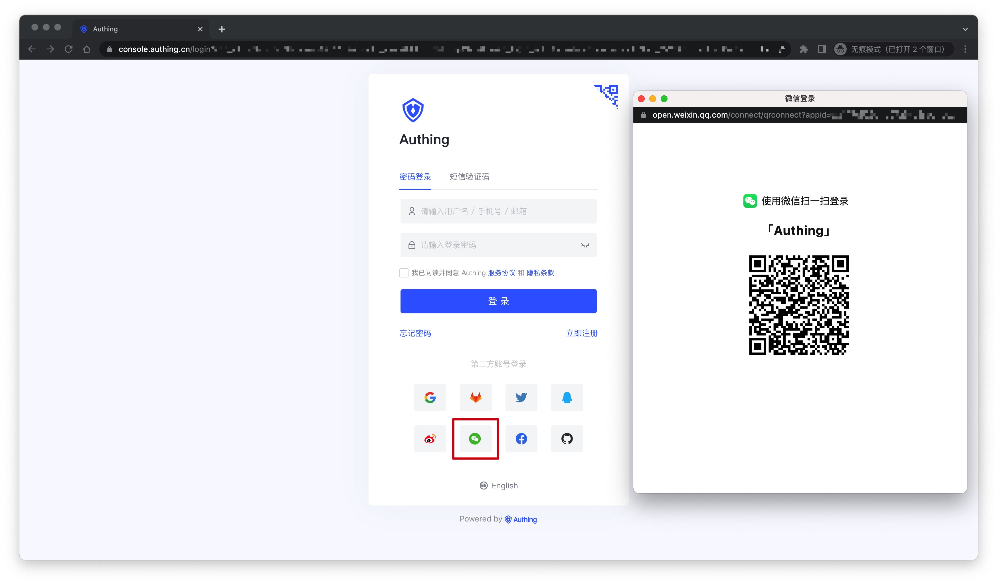

# 微信 PC 扫码

<LastUpdated />

## 场景介绍

- **概述**：微信 PC 扫码登录可以让用户使用微信身份安全登录第三方应用或网站，在 {{$localeConfig.brandName}} 中开启微信扫码登录之后，可实现通过 {{$localeConfig.brandName}} 快速获取微信用户基本开放信息和帮助用户实现基础开放功能。
- **应用场景**：PC 网站
- **终端用户预览图**：

## 注意事项

- 如果你未开通微信开放平台账号，请先前往[微信开放平台](https://open.weixin.qq.com/cgi-bin/frame?t=home/web_tmpl&lang=zh_CN)注册并登录。
- 如果你未开通 {{$localeConfig.brandName}} 控制台账号，请先前往 [{{$localeConfig.brandName}} 控制台](https://authing.cn/) 注册开发者账号。

## 步骤 1：创建网站应用

前往[微信开放平台](https://open.weixin.qq.com/cgi-bin/frame?t=home/web_tmpl&lang=zh_CN)，点击 **管理中心 -> 网站应用 -> 创建网站应用**。创建完成之后，你需要记录下该应用的 `AppID` 和 `AppSecret`，后面需要用到。

请确保该应用获取到了**微信登录**的权限，并将授权回调域设置为 `core.authing.cn`

## 步骤 2：在 {{$localeConfig.brandName}} 控制台配置微信网站应用

2.1 请在 {{$localeConfig.brandName}} 控制台的 **社会化身份源** 页面，点击 **创建社会化身份源** 按钮，进入 **选择社会化身份源** 页面。

2.2 在 **选择社会化身份源** 页面，点击 **微信** 卡片，进入 **微信登录模式** 页面。

2.3 继续点击 **PC 微信扫码** 登录模式，或者点击 **添加** 打开 **PC 微信扫码** 配置页面。

2.4 在 **PC 微信扫码** 配置页面，填写相关的字段信息。

| 字段    | 描述  |
| ------------ | ------ |
| 唯一标识      | a. 唯一标识由小写字母、数字、- 组成，且长度小于 32 位。 b. 这是此连接的唯一标识，设置之后不能修改。    |
| 显示名称      | 这个名称会显示在终端用户的登录界面的按钮上。 |
| AppID        | 微信应用 ID。   |
| AppSecret    | 微信应用密钥    |
| Callback URL | 如果你想直接跳转到社会化身份源进行认证，中间不出现任何 {{$localeConfig.brandName}} 的页面，你可以配置这个参数作为认证成功后的业务回调地址，{{$localeConfig.brandName}} 会将用户的 ID Token 发送到这个 URL。比如你的网站域名是 https://example.com，处理 {{$localeConfig.brandName}} 回调请求的 url 为 /auth/callback，那么你应该填写为 https://example.com/auth/callback。**这个参数和应用配置里的回调链接没有任何关联**。|
| 登录模式      | 开启 **仅登录模式** 后，只能登录既有账号，不能创建新账号，请谨慎选择。   |
| 账号身份关联   | 不开启 **账号身份关联** 时，用户通过身份源登录时默认创建新用户。开启 **账号身份关联** 后，可以允许用户通过 **字段匹配** 或 **询问绑定** 的方式直接登录到已有的账号。 |

2.5 配置完成后，点击 **创建** 或者 **保存** 按钮完成创建。

## 步骤 3：开发接入

- **推荐开发接入方式**：使用托管登录页
- **优劣势描述**：运维简单，由 {{$localeConfig.brandName}} 负责运维。每个用户池有一个独立的二级域名；如果需要嵌入到你的应用，需要使用弹窗模式登录，即：点击登录按钮后，会弹出一个窗口，内容是 {{$localeConfig.brandName}} 托管的登录页面，或者将浏览器重定向到 {{$localeConfig.brandName}} 托管的登录页。
- **详细接入方法**：

3.1 在 {{$localeConfig.brandName}} 控制台创建一个应用，详情查看：[如何在 {{$localeConfig.brandName}} 创建一个应用](/guides/app-new/create-app/create-app.md)

3.2 在已创建好的 **PC 微信扫码** 身份源连接详情页面，开启并关联一个在 {{$localeConfig.brandName}} 控制台创建的应用

3.3 点击 {{$localeConfig.brandName}} 控制台的应用 **体验登录** 按钮，在弹出的登录窗口体验 **PC 微信扫码** 登录

