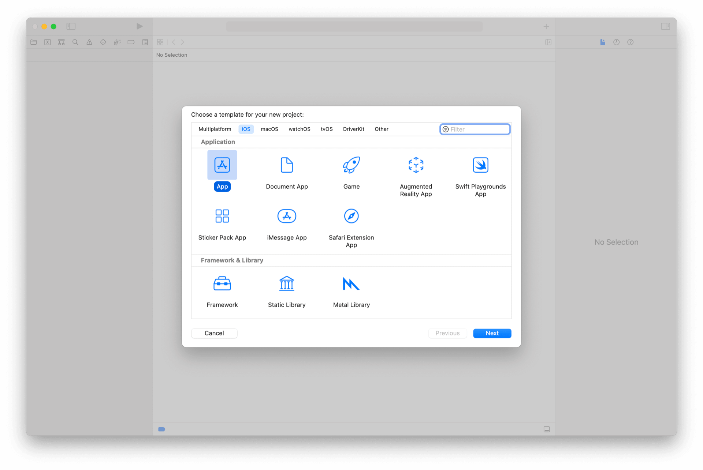

# 快速开始

<LastUpdated/>

## 操作步骤
### 步骤 1：新建 iOS 工程




### 步骤 2：在工程中添加 Guard 依赖

- 在 Xcode 菜单栏右上角选择 **File** 点击 **Add Packages** 。

- 在 Swift Package 搜索栏输入：https://github.com/Authing/guard-ios 。

- 依赖规则选择 **Up to Next Major Version 1.0.0** 。

>  如遇到 Swift Package 链接访问下载缓慢的情况，也可以在 [Realese 版本](https://github.com/Authing/guard-ios/releases)中下载最新版本 Guard.xcframework 的 zip 包，解压后手动导入本地工程。


### 步骤 3：初始化

1. 在 AppDelegate 或 SceneDelegate 中加入 import Guard。

2. 调用 Authing.start() 参数传入 [应用 ID](https://docs.authing.cn/v2/guides/faqs/get-app-id-and-secret.html)。

> Objective-C 项目需创建 Bridging-Header 桥接文件让 OC 与 Swift 互通。

```swift
import Guard

Authing.start(<#AUTHING_APP_ID#>)
 ```
 
<br>


## 常用操作

### 1. 注册/登录并获取用户信息

我们提供了三种方式来帮助开发者实现认证流程：

- 如果想独立构建自己的登录注册等 UI 界面，只调用认证相关接口，推荐[使用 SDK API](./apis/)。
- 如果想两行代码实现包括 UI 的整个认证流程，推荐[使用 Guard 托管页](./develop.md)。
- 如果想通过[语义化编程模型](https://github.com/Authing/guard-android/blob/master/doc/topics/design.md)快速构建自定义风格的认证流程，推荐[使用 Guard 超组件](./component/)。

### 2. [第三方身份源登录](./social/)

### 3. [典型场景](./scenario/)

### 4. [私有化部署](./onpremise.md)
